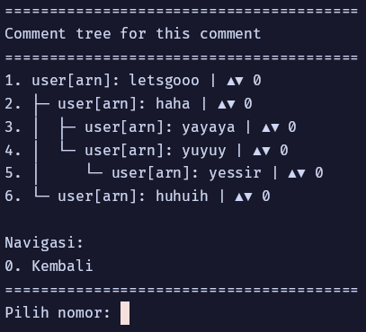

# ELIT - CLI Discussion Forum Application

**Versi 1.0 (Stable Release)**

---

## Preview

Tampilan aplikasi ELIT - CLI Discussion Dorum:

### Trending page


### Tree komentar


### Post page


---

## Deskripsi

**ELIT** adalah aplikasi forum diskusi berbasis Command Line Interface (CLI) yang dikembangkan menggunakan bahasa C. Aplikasi ini dirancang sebagai sarana pembelajaran struktur data dan algoritma, serta praktik pengelolaan data secara persisten dalam konteks aplikasi nyata. ELIT mendukung berbagai fitur utama forum modern, seperti autentikasi aman, board/kategori, posting, komentar bersarang, voting, moderasi, pencarian, dan navigasi berbasis stack.

---

## Fitur Utama

- **Autentikasi Pengguna & Persistent Login**
  - Sistem register/login dengan password terenkripsi menggunakan Argon2 (lihat bagian kredit).
  - Login otomatis jika data login tersimpan (`login.dat`).
  - Logout menghapus data login, sedangkan "Exit" hanya keluar aplikasi tanpa logout.

- **Board (Kategori Diskusi)**
  - Pembuatan, pencarian, dan pengelolaan board.
  - Setiap board memiliki owner dan antrian moderasi.

- **Post & Komentar Bersarang (Tree)**
  - Pengguna dapat membuat post pada board tertentu.
  - Komentar mendukung reply bertingkat tanpa batas (tree/non-binary tree).
  - Penghapusan post/komentar otomatis menghapus seluruh subtree dan votes terkait.

- **Sistem Voting**
  - Upvote/downvote untuk post & komentar.
  - Penghapusan post/komentar juga menghapus semua vote terkait.

- **Moderasi Konten**
  - Board memiliki antrian moderasi (queue) untuk permintaan tertentu.
  - Owner board dapat menerima/menolak permintaan moderasi.

- **Penyimpanan Data Persisten**
  - Semua data (user, board, post, komentar, vote) disimpan ke file `.dat` di folder `storage/`.
  - Data otomatis dimuat saat aplikasi dijalankan dan disimpan saat keluar.

- **Dashboard & Navigasi**
  - Dashboard dengan menu utama, logout, dan fitur exit langsung (tanpa logout).
  - Navigasi halaman menggunakan stack (riwayat halaman).
  - Menu interaktif dengan validasi input dan error handling.

- **Pencarian & Trending**
  - Fitur pencarian instan untuk post, board, dan komentar.
  - Daftar trending/top berdasarkan vote (menggunakan array dan sorting).

---

## Struktur Data yang Digunakan

| No | Struktur Data       | Penggunaan dalam Sistem                                      |
|----|---------------------|-------------------------------------------------------------|
| 1  | Array               | Trending, pencarian, tampilan top komentar/post             |
| 2  | Linked List         | User, post, board, vote, dan daftar tree komentar           |
| 3  | Queue               | Antrian permintaan moderasi board                           |
| 4  | Stack               | Navigasi halaman (riwayat menu/dashboard)                   |
| 5  | Non-Binary Tree     | Komentar bersarang (tree, reply bertingkat tanpa batas)     |

---

## Struktur Direktori

```
ELIT-Discussion-Forum-C/
├── include/         # Header files (struktur data, deklarasi fungsi)
├── src/             # Implementasi kode utama (C source files)
├── storage/         # File data persisten (.dat)
├── build/           # Output binary hasil kompilasi
├── test/            # Unit test (opsional)
├── Makefile         # Build system (Linux/Mac/Windows)
└── README.md        # Dokumentasi ini
```

---

## Cara Build & Menjalankan

### Requirements

- **Compiler:** GCC (GNU Compiler Collection)
- **Library:** Standar C (`stdio.h`, `stdlib.h`, `string.h`, dll)
- **OS:** Linux, macOS, atau Windows (dengan terminal/console)
- **Argon2:** Sudah terintegrasi di repo (tidak perlu install eksternal)

### Build

#### Linux/macOS

```bash
make clean
make
```

#### Windows (menggunakan MinGW)

```bash
mingw32-make clean
mingw32-make
```

### Menjalankan

- Jalankan aplikasi dari folder `build/`:
  ```bash
  ./build/app
  ```
- Semua data akan otomatis tersimpan di folder `storage/`.
- Jika login otomatis aktif, aplikasi langsung masuk dashboard user terakhir.
- Pilihan "Logout" akan menghapus sesi login, sedangkan "Exit" hanya keluar aplikasi tanpa logout.

---

## Catatan Penggunaan

- **Data Persisten:** Semua data (user, board, post, komentar, vote, navigasi) otomatis dimuat dan disimpan ke file `.dat` di folder `storage/`.
- **Login Otomatis:** Jika file `login.dat` ada, aplikasi langsung login sebagai user terakhir.
- **Logout:** Menghapus file `login.dat` dan kembali ke menu utama.
- **Exit:** Keluar aplikasi tanpa logout (sesi tetap tersimpan jika login otomatis aktif).
- **Moderasi:** Hanya owner board yang dapat mengelola antrian moderasi.
- **Navigasi:** Riwayat halaman disimpan menggunakan stack, dapat dilanjutkan saat aplikasi dijalankan kembali.

---

## Status Pengembangan

**Versi 1.0 - Selesai.**
- Seluruh fitur utama telah diimplementasikan dan aplikasi siap digunakan.
- Tidak ada pengembangan aktif lebih lanjut, kecuali perbaikan bug minor jika ditemukan.

---

## Kredit & Lisensi

- **Argon2 Password Hashing**
  Aplikasi ini menggunakan implementasi Argon2 untuk hashing password yang diambil dari:
  [https://github.com/P-H-C/phc-winner-argon2](https://github.com/P-H-C/phc-winner-argon2)
  Lisensi Argon2: [CC0 1.0 Universal](https://creativecommons.org/publicdomain/zero/1.0) dan [Apache 2.0](https://www.apache.org/licenses/LICENSE-2.0)

- **Kontributor ELIT**
  - Tim pengembang ELIT (lihat komentar di source code untuk detail kontributor)

---

## Disclaimer

Aplikasi ini dibuat untuk tujuan pembelajaran dan demonstrasi struktur data di lingkungan CLI. Tidak disarankan untuk penggunaan produksi tanpa audit keamanan lebih lanjut.

---
